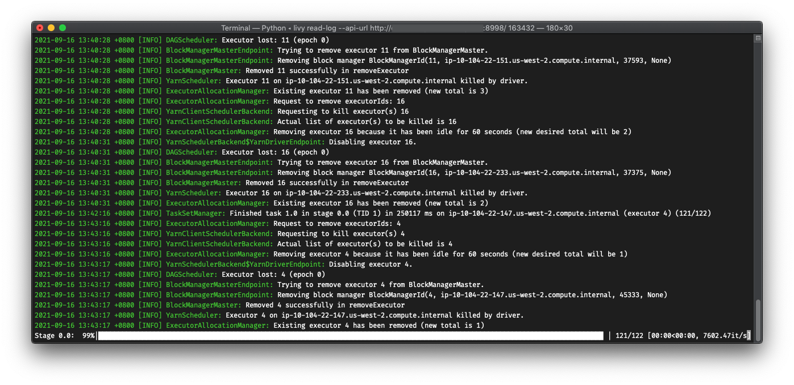

# Python-Livy


> Still under developing. API might not be stable at this time.

Lightweight tool to interact with [Apache Livy](https://livy.incubator.apache.org/). Provide both CLI tools and library that works nicely in pure and native Python.



features:

1. Log watching and parsing

    It could parse livy's mixed-stdout logs back to log records and submit to Python's `logging` system. Then we could watch for the events in a much friendly way.

2. Configurable

    For using CLI tools, it provides configuration system for saving common used variables on local storage. No need to set every option on each command.

3. Human friendly log viewer

    On using CLI for reading logs, it could have colored logs and progress bar. Besides, we could highlight or hide specific logger via arguments (e.g. hide `TaskSetManager` as we've got progress bar).

4. Extensible

    Custom function could be triggered during submission. So bring it to infinity...and beyond!

5. Fully tested

    100% coverage. Both with and without extra dependencies are tested, thanks to Github action.


## Installation

Install via `pip`:

```bash
pip install -U 'git+https://github.com/tzing/python-livy.git#egg=livy[pretty]'
```

Or get the wheel from [release](https://github.com/tzing/python-livy/releases/latest).


## Docs

https://tzing.github.io/python-livy/
